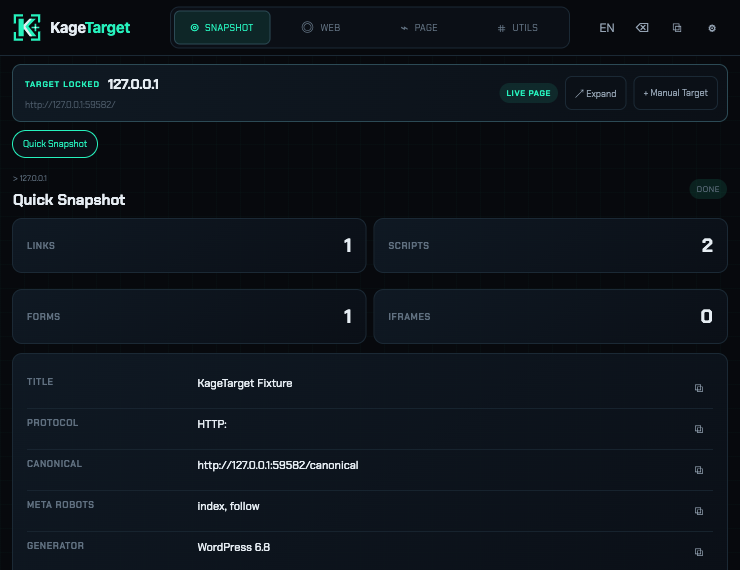
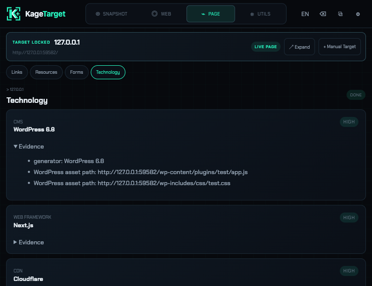
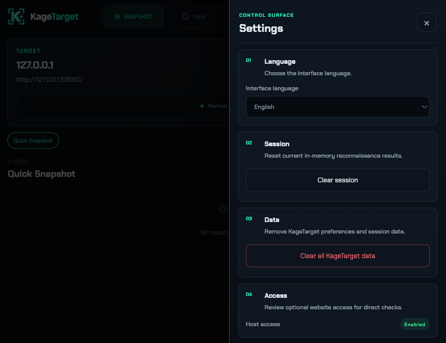
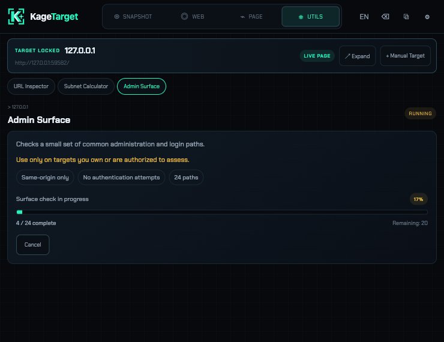

<p align="center"></p>

# KageTarget

<p align="center">
  <strong>Tarayıcı içinde hızlı ve yerel web keşfi.</strong><br>
  <em>Fast, local web reconnaissance inside your browser.</em>
</p>

<p align="center"><a href="#türkçe">Türkçe</a> · <a href="#english">English</a></p>

## Görseller / Screenshots

| Genel Bakış / Overview | Teknoloji / Technology |
|---|---|
|  |  |

| Ayarlar / Settings | Tarama İlerlemesi / Scan Progress |
|---|---|
|  |  |

## Türkçe

KageTarget, Chrome için geliştirilmiş yerel bir web keşif eklentisidir. Açık sekmeyi veya elle girdiğiniz bir HTTP(S) adresini analiz eder. Ana arayüz kompakt Chrome popup’ıdır; isteğe bağlı Side Panel desteği de vardır.

### Özellikler

- Sayfa başlığı, canonical, robots, generator, bağlantı, script, form ve iframe özeti
- HTTP ve güvenlik başlıkları ile CSP inceleme
- `robots.txt`, `security.txt` ve `sitemap.xml` kontrolü
- Bağlantı, kaynak ve form listeleri
- Kanıtlarıyla birlikte teknoloji algılama
- URL inceleyici ve IPv4 alt ağ hesaplayıcı
- Aynı kaynaktaki 24 yaygın yönetim/giriş yolunu kontrollü inceleme
- Manuel hedef, Focus Mode, Türkçe/İngilizce arayüz ve isteğe bağlı Side Panel

### Kullanım

1. Normal bir HTTP veya HTTPS sitesi açın.
2. Chrome araç çubuğundaki KageTarget simgesine tıklayın.
3. İlk kullanımda isteğe bağlı site erişimini açın veya sınırlı modda devam edin.
4. **Analiz Et** düğmesine basın.
5. Üst menüden **Özet**, **Web**, **Sayfa** veya **Araçlar** bölümünü seçin.

Başka bir adresi incelemek için **Manuel Hedef** seçeneğini kullanabilirsiniz. Ağ kontrolleri kimlik bilgisi göndermez.

### Kaynaktan kurulum

```bash
npm install
npm run build
```

Ardından:

1. Chrome’da `chrome://extensions` adresini açın.
2. **Geliştirici modu**nu etkinleştirin.
3. **Paketlenmemiş öğe yükle** seçeneğine tıklayın.
4. Projedeki `dist/` klasörünü seçin.

### Gizlilik ve güvenli kullanım

KageTarget hesap, reklam, analytics, telemetri veya backend kullanmaz. Sonuçlar bellekte tutulur; yalnızca dil ve sınırlı mod tercihleri yerel olarak saklanır. Aracı sadece sahibi olduğunuz veya test izniniz bulunan sistemlerde kullanın.

[Gizlilik Politikası](docs/PRIVACY_POLICY.md) · [İzin Açıklaması](docs/PERMISSIONS.md)

---

## English

KageTarget is a local web reconnaissance extension for Chrome. It analyzes the active tab or an HTTP(S) address you enter manually. Its primary interface is a compact Chrome popup, with an optional Side Panel.

### Features

- Quick summary of title, canonical, robots, generator, links, scripts, forms, and iframes
- HTTP headers, security headers, and CSP inspection
- Checks for `robots.txt`, `security.txt`, and `sitemap.xml`
- Link, resource, and form listings
- Technology detection with visible evidence
- URL inspector and IPv4 subnet calculator
- Controlled checks for 24 common same-origin admin and login paths
- Manual targets, Focus Mode, English/Turkish UI, and an optional Side Panel

### Usage

1. Open a normal HTTP or HTTPS website.
2. Click the KageTarget icon in the Chrome toolbar.
3. On first use, enable optional site access or continue in limited mode.
4. Click **Analyze**.
5. Choose **Snapshot**, **Web**, **Page**, or **Utils** from the top navigation.

Use **Manual Target** to inspect another address. Network checks never send credentials.

### Install from source

```bash
npm install
npm run build
```

Then:

1. Open `chrome://extensions`.
2. Enable **Developer mode**.
3. Click **Load unpacked**.
4. Select the project’s `dist/` directory.

### Privacy and responsible use

KageTarget has no account, advertising, analytics, telemetry, or backend. Results stay in memory; only language and limited-mode preferences are stored locally. Use it only on systems you own or are authorized to test.

[Privacy Policy](docs/PRIVACY_POLICY.md) · [Permission Rationale](docs/PERMISSIONS.md)

## Development

```bash
npm run typecheck
npm run lint
npm run test
npm run test:e2e
npm run package
```

`npm run package` creates `release/kagetarget-3.6.0.zip`.

Chrome Web Store preparation details are available in [Store Readiness](docs/STORE_READINESS.md).
