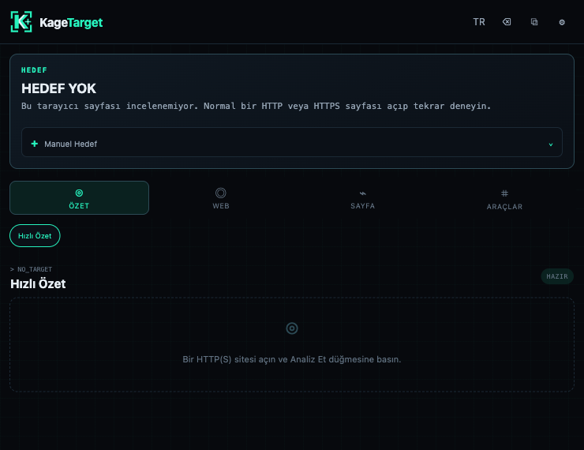
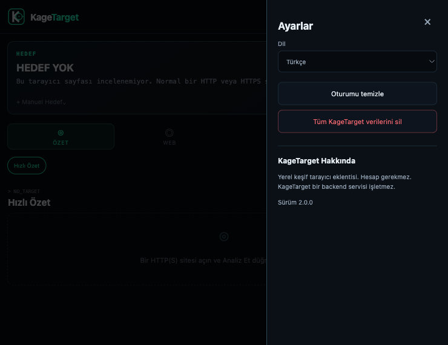
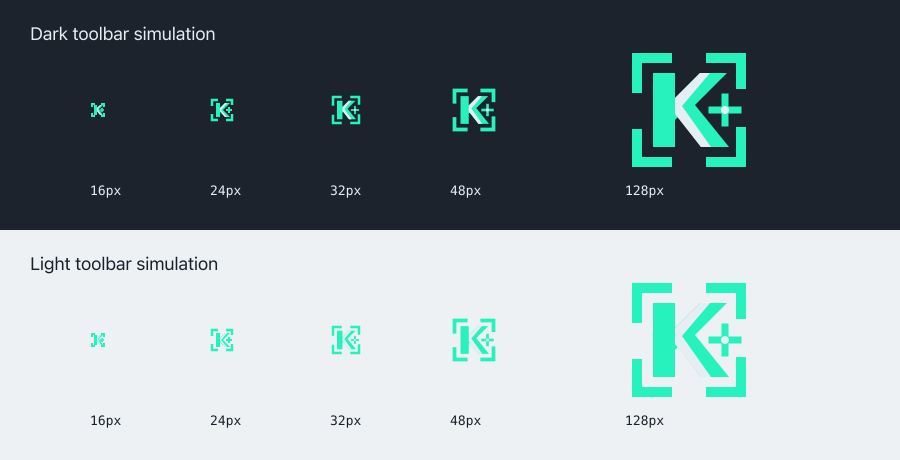

<p align="center"></p>

# KageTarget

Fast browser-native web reconnaissance from a Chrome extension. KageTarget provides user-initiated inspection of the active page or an explicitly supplied HTTP(S) target through a compact Action Popup, with an optional Side Panel workspace.

## Preview

| Action Popup | Settings |
|---|---|
|  |  |

The toolbar mark is optically sized for every supported Chrome icon size:



## Features

- Quick Snapshot for title, canonical metadata, robots directives, generator, links, scripts, forms, and iframes
- HTTP Headers, Security Headers, and CSP Inspector
- Explicit checks for robots.txt, security.txt, and sitemap.xml
- Links, Resources, Forms, and evidence-based Technology Hints
- URL Inspector and tested IPv4 Subnet Calculator
- Manual HTTP(S) Target with bounded static HTML inspection
- Optional Side Panel, English/Turkish UI, Clear Session, and Clear All

## Usage

1. Open a normal HTTP(S) website.
2. Click the KageTarget toolbar icon.
3. KageTarget detects the active tab.
4. Click **Analyze**.
5. Select Snapshot, Web, Page, or Utils.

**Manual Target** lets a researcher inspect another explicit HTTP(S) target without changing the open tab. Live mode reads bounded metadata from the rendered page. Remote mode makes a credential-free request and parses up to 512 KB of HTML as an inert static document; it is labeled **STATIC HTML**.

## Privacy

KageTarget has no account, analytics, telemetry, advertising, backend service, or persistent scan history. Scan results remain in memory. The language preference is stored locally. User-triggered network checks communicate directly with the selected target and omit credentials.

See the [Privacy Policy](docs/PRIVACY_POLICY.md) and [Permission Rationale](docs/PERMISSIONS.md).

## Install from source

1. Run `npm install` and `npm run build`.
2. Open `chrome://extensions`.
3. Enable Developer Mode.
4. Choose **Load unpacked**.
5. Select the generated `dist/` directory.

## Development

```bash
npm install
npm run dev
npm run typecheck
npm run lint
npm run test
npm run test:e2e
npm run build
npm run package
```

`npm run package` creates `release/kagetarget-3.1.1.zip` with `manifest.json` at the archive root.

## Architecture

- Chrome Manifest V3 with Action Popup as the primary interface
- Optional Side Panel using the same React application
- Strict TypeScript, React, Vite, Vitest, and a Puppeteer Chrome harness
- In-memory scan state and local-only language preference
- Central target parser, permission boundary, DOM extraction, and network policy
- Explicit direct requests using `credentials: "omit"` and `cache: "no-store"`

## Limitations

- Restricted browser pages cannot be inspected.
- Browser security policies can affect readable network responses.
- Technology detection is heuristic and intentionally conservative.
- Native toolbar interaction may require manual validation because browser automation cannot reliably click Chrome toolbar actions.

## Ethical use

Use KageTarget only on systems you own or are authorized to test.

Chrome Web Store preparation details are documented in [Store Readiness](docs/STORE_READINESS.md). A license has not yet been selected.
